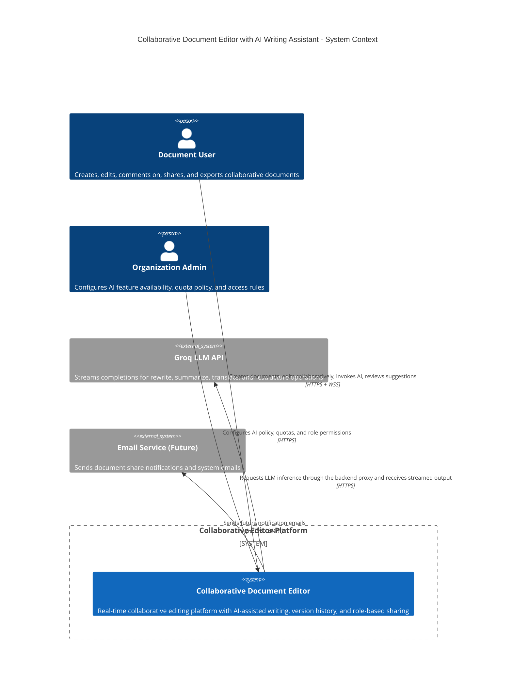
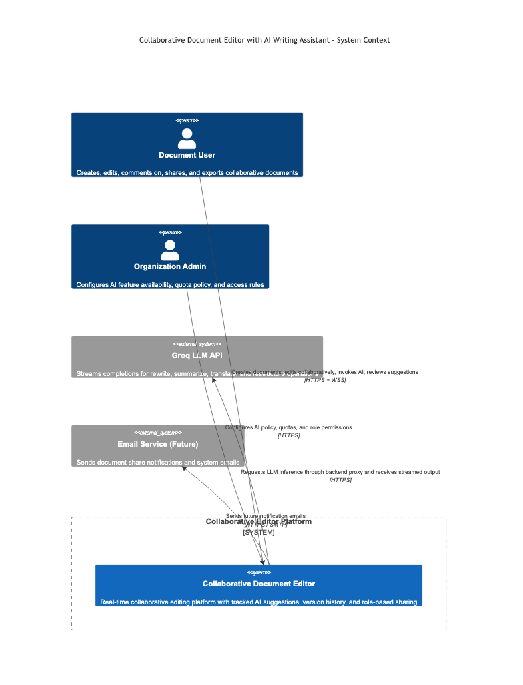
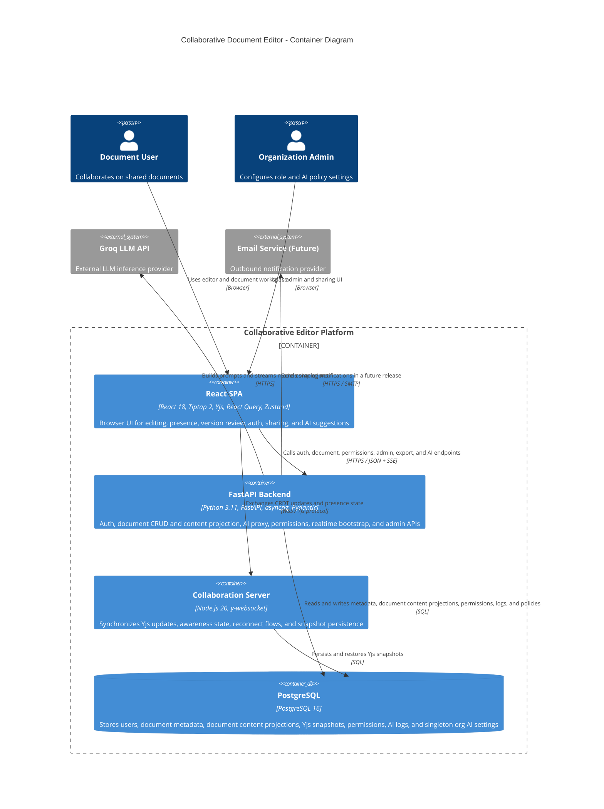
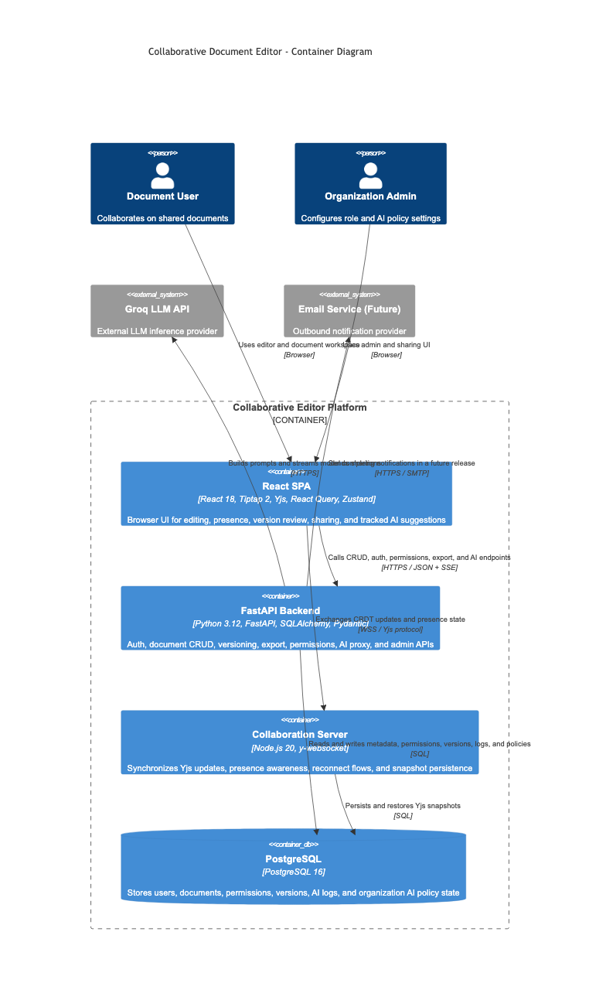
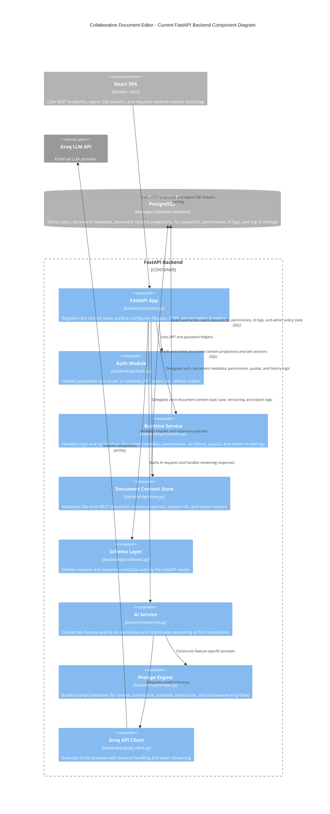
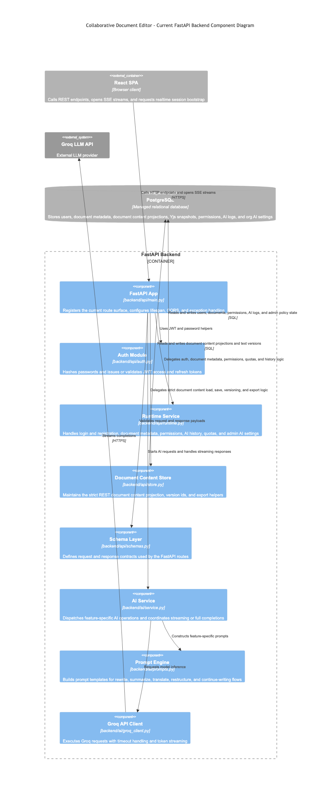
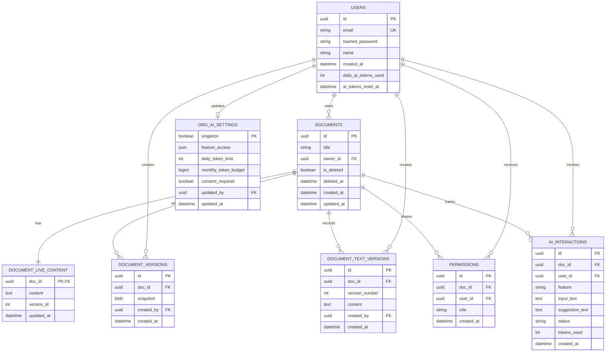
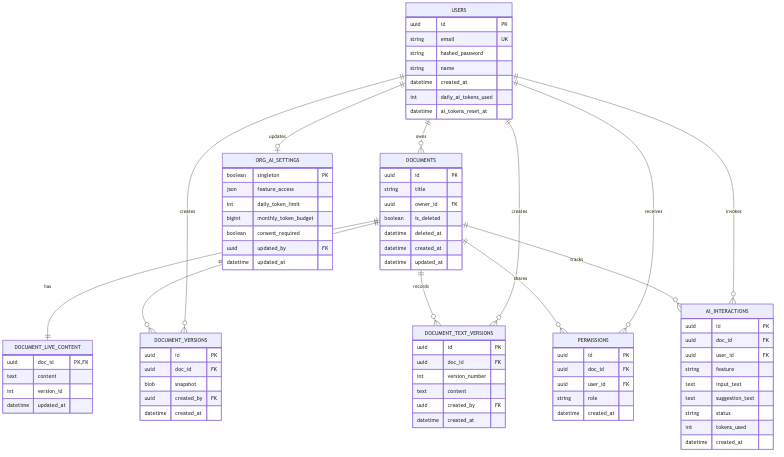

{0}------------------------------------------------

# Collaborative Document Editor with AI Writing Assistant

## Assignment 1: Requirements Engineering, Architecture & Proof of Concept

### **Prepared by:**

Teya, Temiko, Atharv, Tanisha

**Course:** AI1220 - Software Engineering  
Spring 2026

## Introduction ---

This report documents the requirements engineering, system architecture, and proof-of-concept for a real-time collaborative document editor with an integrated AI writing assistant. It is submitted as part of the first group assignment of the Software Engineering course (AI1220) in the Spring 2026 semester at MBZUAI.

The report covers stakeholder analysis, functional and non-functional requirements, a full C4 architecture model, data modelling, project management, and a working proof-of-concept. The technical decisions documented here will form the foundation for implementation in subsequent assignment stages.

March 2026

{1}------------------------------------------------

## 1 Requirements Engineering

### 1.1 Stakeholder Analysis

| Stakeholder                      | Goals                                                                                                           | Concerns                                                                                                                                                                              | Influence on Requirements                                                                                                                                                                                  |
|----------------------------------|-----------------------------------------------------------------------------------------------------------------|---------------------------------------------------------------------------------------------------------------------------------------------------------------------------------------|------------------------------------------------------------------------------------------------------------------------------------------------------------------------------------------------------------|
| S1: Product Owners / Founders    | Deliver AI-native competitive differentiation; prioritize rapid MVP launch and cost-efficiency.                 | Scope expansion; LLM cost volatility; reputation risks from system instability.                                                                                                       | AI-assisted editing as a first-class feature; implement per-user token quotas and a lean MVP scope.                                                                                                        |
| S2: Enterprise IT Admins         | Centralized user management; comprehensive audit logging; adherence to their corporate security policies.       | Unauthorized data exfiltration via LLM APIs; lack of SSO/RBAC integration; absence of data residency controls.                                                                        | Implement administrative controls for AI configuration; maintain comprehensive audit trails for document access and AI history; ensure data-handling transparency.                                         |
| S3: LLM API Provider (Groq)      | Maintain reliable high-throughput inference; ensure equitable resource distribution, which leads to fair usage. | API key exposure; rate-limit exhaustion; excessive token consumption; multi-tenant stability                                                                                          | Implement backend-proxied AI calls; Slowing intentionally a service to prevent a system breakdown;design graceful degradation for temporary service interruptions; setting token budgets for each request. |
| S4: Privacy/ Compliance Officers | Achieve GDPR/SOC2 compliance; validate institutional data policy adherence.                                     | Violate data regulations through sharing documents' content to third-party LLM, causing cross-border data transfers; accumulate legal liability from indefinite AI logging.           | Require explicit user consent; automate 90-day AI log retention and user-deletable; Encrypt data at rest and in transit.                                                                                   |
| S5: QA / Testing Engineers       | Validate correctness of real-time synchronization, AI-generated rendering, role-based permission enforcement.   | Incur unreliable test results from non-deterministic synchronization; encounter hard-to-reproduce edge cases due to variable AI response outputs.                                     | Develop mockable AI service interfaces for isolated testing; implement deterministic Yjs conflict resolution; define structured error codes.                                                               |
| S6: DevOps / Platform Engineers  | Automate deployment, monitoring and scaling operations; maintain uptime during production deployments.          | Risk data loss during live DB migrations; expose sensitive information because of the multi-service secrets management; Face scaling limitations from stateful y-websocket singleton. | Standardize a single monorepo deployment pipeline; integrate health-check endpoints; formulate secrets management protocols for API credentials.                                                           |

{2}------------------------------------------------

### 1.2 Functional Requirements

#### FR-RT: Real-time collaboration

| ID       | Requirement                                                                                                                                                                                                         | Acceptance Criteria                                                                                                       |
|----------|---------------------------------------------------------------------------------------------------------------------------------------------------------------------------------------------------------------------|---------------------------------------------------------------------------------------------------------------------------|
| FR-RT-01 | Keystroke propagation: upon a user keystroke, Yjs encodes the document delta, transmits it via WebSocket to the collaboration server, which broadcasts the update to all connected clients for rendering in Tiptap. | Character changes are visible to all collaborators within 300 ms under same-region network conditions.                    |
| FR-RT-02 | Presence awareness: all connected users' avatars, cursor positions, and active text selections are rendered in perceptually distinct colours, updated in real time across all sessions.                             | Cursor position updates propagate within 500 ms; the active user list reflects connect and disconnect events immediately. |
| FR-RT-03 | Concurrent region conflict resolution: when two users edit the same paragraph within a one-second window, the Yjs CRDT algorithm merges both contributions deterministically without data loss.                     | Automated tests confirm that two clients inserting content at the same offset both appear in the final document state.    |
| FR-RT-04 | Offline resilience: upon network disconnection, local edits are preserved within the Yjs state buffer; upon reconnection, the system performs bidirectional synchronisation to reconcile diverged states.           | Simulated disconnect and reconnect sequences result in zero edit loss on either the local or remote client.               |
| FR-RT-05 | Session join: when a new user opens an existing document, the system loads the latest persisted snapshot alongside any pending Yjs updates and renders the complete current document state.                         | A newly connected client displays all document content, including edits that were in-flight at the time of joining.       |

#### FR-AI: AI Writing Assistant

| ID       | Requirement                                                                                                                                                                                                                                                                                                 | Acceptance Criteria                                                                                                                                                                                            |
|----------|-------------------------------------------------------------------------------------------------------------------------------------------------------------------------------------------------------------------------------------------------------------------------------------------------------------|----------------------------------------------------------------------------------------------------------------------------------------------------------------------------------------------------------------|
| FR-AI-01 | AI-assisted rewrite: the user selects a text passage and invokes the rewrite feature, upon which the backend constructs a prompt, proxies the request to the Groq LLM API, and streams the generated response back to the client via Server-Sent Events, rendering it as an inline tracked-change proposal. | The AI suggestion appears within 3 seconds of invocation and is presented as a reviewable deletion and insertion diff inline within the document.                                                              |
| FR-AI-02 | AI-assisted summarisation: the user selects a passage and invokes the summarise feature, upon which the system generates a condensed version of the selected content and presents it as a tracked-change proposal replacing the original selection.                                                         | The generated summary is measurably shorter than the original selection and is rendered as a reviewable diff that the user can accept or reject.                                                               |
| FR-AI-03 | AI-assisted translation: the user selects a passage and specifies a target language, upon which the system generates a translated version of the selected content and presents it as a tracked-change proposal, preserving the original text until an explicit acceptance action is performed.              | The translated output is produced in the correct target language and the original text remains intact and recoverable until the user accepts the proposal.                                                     |
| FR-AI-04 | Suggestion acceptance controls: the user may fully accept, fully reject, or partially accept a sub-range of an AI-generated suggestion. An undo operation must remain available following any acceptance action, allowing the user to revert the applied change.                                            | Full acceptance applies the suggestion to the document; full rejection restores the original content; partial acceptance applies only the selected sub-range; Ctrl+Z successfully reverts any accepted change. |
| FR-AI-05 | Streaming user experience: AI-generated suggestions are delivered to the client word-by-word via Server-Sent Events, accompanied by a visible generation indicator and a cancel button that allows the user to abort the operation mid-stream.                                                              | The first generated token is rendered within 1 second of invocation; cancellation immediately discards the partial result and restores the document to its pre-invocation state.                               |
| FR-AI-06 | Interaction logging: every AI feature invocation is persisted to the <code>ai_interactions</code> table, recording the invoked feature, input text, generated suggestion, and the user's subsequent action.                                                                                                 | Each log entry is created with valid foreign key references to both the associated document and the invoking user.                                                                                             |
| FR-AI-07 | Soft-lock mechanism: upon AI processing of a target paragraph, the system displays an <i>AI is processing</i> indicator to all other active collaborators and queues their edits to that region until the suggestion has been rendered or the operation has timed out.                                      | The soft lock is automatically released within 5 seconds in the event of an AI processing failure, restoring full edit access to the affected region for all collaborators.                                    |

{3}------------------------------------------------

#### FR-DM: Document Management

| ID       | Requirement                                                                                                                                                                                                                                                                                      | Acceptance Criteria                                                                                                                                                   |
|----------|--------------------------------------------------------------------------------------------------------------------------------------------------------------------------------------------------------------------------------------------------------------------------------------------------|-----------------------------------------------------------------------------------------------------------------------------------------------------------------------|
| FR-DM-01 | Document creation: upon user request, the system instantiates a new empty document, assigns the creator as the document owner, and immediately opens it in the editor interface.                                                                                                                 | The newly created document appears in the user's document list and the owner permission record is correctly set upon creation.                                        |
| FR-DM-02 | Version history: the system maintains a chronological list of document snapshots, each recording a timestamp and authoring user. Users may preview any historical version and revert to it via a non-destructive operation that creates a new snapshot rather than overwriting existing history. | The version history displays the last 50 snapshots; performing a revert operation produces a new version row in the history rather than modifying any existing entry. |
| FR-DM-03 | Document sharing: the document owner may share access with other registered users by specifying their email address and assigning a permission role, upon which a permission record is created and the shared user gains immediate access to the document.                                       | The system correctly enforces editor, commenter, and viewer roles; permission changes take effect immediately upon creation without requiring a session refresh.      |
| FR-DM-04 | Document export: the system generates a downloadable export of the current document state in the user's choice of PDF, DOCX, or Markdown format.                                                                                                                                                 | The exported file accurately reproduces all document content with basic formatting preserved across all three supported formats.                                      |
| FR-DM-05 | Soft deletion: upon owner-initiated deletion, the document is hidden from all document listings but retained in storage and remains recoverable for a period of 30 days before permanent removal.                                                                                                | Deleted documents are absent from all document list views; the document remains restorable via the API within the 30-day retention window.                            |

#### FR-UM: User Management & Authentication

| ID       | Requirement                                                                                                                                                                                                                                                           | Acceptance Criteria                                                                                                                                                                  |
|----------|-----------------------------------------------------------------------------------------------------------------------------------------------------------------------------------------------------------------------------------------------------------------------|--------------------------------------------------------------------------------------------------------------------------------------------------------------------------------------|
| FR-UM-01 | User registration and authentication: upon registration, the system stores a bcrypt-hashed password and issues a JWT access token valid for 15 minutes alongside a refresh token valid for 7 days; each refresh operation rotates the refresh token to prevent reuse. | Passwords are never stored or transmitted in plaintext; token refresh operations are transparent to the user with no visible interruption to their session.                          |
| FR-UM-02 | Role-based authorisation: the system enforces per-document permission checks on every action, including viewing, editing, commenting, AI invocation, sharing, and deletion, according to the role assigned to the requesting user.                                    | Viewers are prevented from editing; commenters are prevented from invoking AI or editing; editors are prevented from sharing; only document owners may share or delete the document. |
| FR-UM-03 | Session handling: upon JWT expiry, the system automatically attempts to obtain a new access token using the stored refresh token; if the refresh token has also expired, the user is redirected to the login screen.                                                  | No data loss occurs during a token refresh operation; the session renewal process produces no visible interruption to the user's workflow.                                           |
| FR-UM-04 | Organisation administrator configuration: organisation administrators may toggle the availability of individual AI features on a per-role basis and configure organisation-level AI usage quotas through the administration interface.                                | Configuration changes take effect on the next AI invocation; requests that exceed the configured quota receive a 429 response code.                                                  |

{4}------------------------------------------------

### 1.3 Non-Functional Requirements

#### Non-Functional Requirements

| ID         | Category     | Target                                                                                                                                                                                                       | Justification                                                                                                                                                                                                                                       |
|------------|--------------|--------------------------------------------------------------------------------------------------------------------------------------------------------------------------------------------------------------|-----------------------------------------------------------------------------------------------------------------------------------------------------------------------------------------------------------------------------------------------------|
| NFR-LAT-01 | Latency      | Keystroke propagation latency must not exceed 300 ms at the 95th percentile.                                                                                                                                 | This threshold corresponds to the boundary of perceived liveness in collaborative editing. Yjs over WebSocket typically achieves sub-100 ms, providing sufficient headroom.                                                                         |
| NFR-LAT-02 | Latency      | The first AI-generated token must be delivered to the client within 1.5 seconds at the 95th percentile.                                                                                                      | Groq LPU hardware returns first tokens within 200–500 ms. The remaining budget accommodates network overhead, prompt construction, and API latency. SSE streaming makes delivery feel immediate.                                                    |
| NFR-LAT-03 | Latency      | Document load time must not exceed 2 seconds for documents up to 100 KB in size.                                                                                                                             | Google Web Vitals research identifies 2 seconds as the abandonment threshold. A 100 KB document corresponds to approximately 50,000 words, covering the vast majority of practical use cases.                                                       |
| NFR-SC-01  | Scalability  | The system must support a minimum of 20 concurrent editors per document.                                                                                                                                     | Yjs awareness protocol broadcasts with $O(n)$ complexity; at 20 concurrent users the overhead remains lightweight and covers typical collaborative team scenarios.                                                                                  |
| NFR-SC-02  | Scalability  | The system must support a minimum of 200 concurrently active documents system-wide.                                                                                                                          | This figure represents the ceiling of a single y-websocket instance. Exceeding this threshold requires horizontal scaling, which is acknowledged as a known architectural limitation.                                                               |
| NFR-SC-03  | Scalability  | The system must accommodate 50 concurrent users at demonstration and scale to 500 registered users within one year.                                                                                          | PostgreSQL handles this load comfortably. The y-websocket server represents the binding constraint; the defined upgrade path involves Hocuspocus with Redis pub/sub for horizontal scaling.                                                         |
| NFR-AV-01  | Availability | The system must maintain 99.5% monthly uptime, corresponding to a maximum of approximately 3.6 hours of downtime per month.                                                                                  | This target is realistic for a Render-hosted deployment without multi-region redundancy and represents an appropriate baseline for the project's context.                                                                                           |
| NFR-AV-02  | Availability | The system must tolerate partial service failures without complete loss of functionality.                                                                                                                    | WebSocket server failure permits continued local editing via Yjs offline mode. API failure disables AI and CRUD operations while editing remains functional. Groq unavailability disables AI features only, leaving all other functionality intact. |
| NFR-SP-01  | Security     | TLS 1.2 or higher must be enforced on all connections, including HTTPS and WSS.                                                                                                                              | Render provides TLS termination by default, satisfying this requirement without additional configuration.                                                                                                                                           |
| NFR-SP-02  | Security     | All data at rest must be encrypted using AES-256.                                                                                                                                                            | Render-managed PostgreSQL applies AES-256 encryption by default; all automated backups inherit the same encryption policy.                                                                                                                          |
| NFR-SP-03  | Security     | Data transmitted to the Groq API must be limited to the user's selection and a maximum of 500 tokens of surrounding context. The full document must never be transmitted unless the user explicitly opts in. | This constraint serves dual purposes of cost control and privacy protection. Groq enterprise terms specify that input data is not used for model training and is not retained beyond the duration of the request.                                   |
| NFR-SP-04  | Security     | AI interaction logs must be automatically purged after 90 days and must be deletable by the user on demand.                                                                                                  | Automated retention limits reduce legal liability and ensure compliance with data minimisation principles under applicable privacy regulations.                                                                                                     |

{5}------------------------------------------------

| ID        | Category  | Target                                                                                                                                                                                                                                                            | Justification                                                                                                                                                         |
|-----------|-----------|-------------------------------------------------------------------------------------------------------------------------------------------------------------------------------------------------------------------------------------------------------------------|-----------------------------------------------------------------------------------------------------------------------------------------------------------------------|
| NFR-US-01 | Usability | When more than 10 collaborators are active, the interface must display a condensed badge indicating the number of additional users. Cursor colours must be drawn from a 20-colour perceptually distinct palette, with edge markers indicating off-screen cursors. | These constraints prevent interface clutter and maintain usability at scale, ensuring the collaborative presence layer does not obstruct the editing experience.      |
| NFR-US-02 | Usability | AI features must be accessible via three interaction methods: a floating toolbar appearing on text selection, a right-click context menu, and keyboard shortcuts (Ctrl+Shift+R for rewrite; Ctrl+Shift+S for summarise).                                          | Providing multiple access points improves feature discoverability and accommodates different user interaction preferences and workflows.                              |
| NFR-US-03 | Usability | The interface must conform to WCAG 2.1 Level AA. All functionality must be keyboard-navigable, AI suggestions must be announced by screen readers, and colour must never serve as the sole indicator of system state.                                             | WCAG 2.1 AA represents the accepted accessibility baseline for professional software products, ensuring the platform is usable by users with a range of disabilities. |

#### Requirements Prioritisation

| Priority                  | Requirements                                                                                                                                                                                                                                                                                                                                                                                                                                                                                                |
|---------------------------|-------------------------------------------------------------------------------------------------------------------------------------------------------------------------------------------------------------------------------------------------------------------------------------------------------------------------------------------------------------------------------------------------------------------------------------------------------------------------------------------------------------|
| Must Have (MVP)           | FR-RT-01 (keystroke propagation), FR-RT-02 (presence awareness), FR-RT-03 (conflict resolution), FR-AI-01 (rewrite), FR-AI-04 (accept/reject), FR-AI-05 (streaming), FR-AI-06 (interaction logging), FR-DM-01 (document creation), FR-DM-03 (sharing), FR-UM-01 (authentication), FR-UM-02 (RBAC), NFR-LAT-01 (keystroke latency), NFR-SP-01 (TLS).                                                                                                                                                         |
| Should Have               | FR-RT-04 (offline resilience), FR-RT-05 (session join), FR-AI-02 (summarisation), FR-AI-03 (translation), FR-AI-07 (soft lock), FR-DM-02 (version history), FR-DM-04 (export), FR-UM-03 (session handling), NFR-LAT-02 (AI first token), NFR-LAT-03 (document load), NFR-SC-01 (concurrent editors), NFR-SC-02 (concurrent documents), NFR-SC-03 (user growth), NFR-AV-01 (uptime), NFR-AV-02 (partial failure), NFR-SP-02 (encryption at rest), NFR-US-01 (collaborator UI), NFR-US-02 (AI access points). |
| Could Have                | FR-DM-05 (soft deletion), FR-UM-04 (organisation admin configuration), FR-AI-04 partial acceptance (advanced sub-range), NFR-US-03 (full WCAG 2.1 AA), NFR-SP-03 (minimal Groq context), NFR-SP-04 (automated log purge).                                                                                                                                                                                                                                                                                   |
| Won't Have (this project) | SSO/OAuth integration; link-based document sharing; team-based permission groups; horizontal collaboration server scaling; real-time commenting system; mobile-optimised user interface.                                                                                                                                                                                                                                                                                                                    |

### 1.4 User Stories and Scenarios

| ID    | Story                                                                                                                        | Expected Behaviour                                                                                                                                                  |
|-------|------------------------------------------------------------------------------------------------------------------------------|---------------------------------------------------------------------------------------------------------------------------------------------------------------------|
| US-01 | As an editor, I want to see collaborators' cursors and selections in real time so that I can avoid editing the same region.  | Each remote cursor is rendered with a distinct colour and name label; selections are highlighted; cursor updates propagate within 500 ms.                           |
| US-02 | As a user who loses connectivity, I want local edits preserved and synchronised upon reconnection so that I never lose work. | Yjs buffers edits locally during disconnection; reconnection triggers bidirectional synchronisation; a toast notification confirms successful sync.                 |
| US-03 | As a collaborator, when two users edit the same paragraph simultaneously, I expect both edits to be preserved.               | Yjs CRDT convergence ensures both insertions are present in the final document state, ordered by client ID tiebreaker.                                              |
| US-04 | As a team lead, I want to revert to a previous document version while others are actively editing.                           | Revert creates a new snapshot applied as a Yjs update; collaborators see the reverted state with their in-flight edits merged on top; a notification is dispatched. |

{6}------------------------------------------------

| ID    | Story                                                                                                                        | Expected Behaviour                                                                                                                                                                                              |
|-------|------------------------------------------------------------------------------------------------------------------------------|-----------------------------------------------------------------------------------------------------------------------------------------------------------------------------------------------------------------|
| US-05 | As a writer, I want to select text and request an AI rewrite in a more formal register.                                      | The suggestion streams as a tracked-change proposal with strikethrough on the original and highlighted insertion; accept, reject, and partial accept are available; the original is preserved until acceptance. |
| US-06 | As a researcher, I want to select a long section and receive an AI-generated summary.                                        | The summary replaces the selection as a tracked-change proposal; it is measurably shorter than the original; a side-by-side comparison is presented before the user decides.                                    |
| US-07 | As an international collaborator, I want to translate selected text into another language without leaving the editor.        | A language picker triggers a translated tracked-change proposal; the original text is preserved until the user explicitly accepts.                                                                              |
| US-08 | As a user, I want to accept only a portion of an AI suggestion and discard the remainder.                                    | The user selects a sub-range within the suggestion and accepts only that portion; the remainder is discarded; the operation is implemented as a Yjs transaction.                                                |
| US-09 | As a user, when AI is generating a suggestion and I wish to abort, I want to cancel the operation mid-stream.                | Cancellation aborts the SSE stream, discards the partial result, and restores the document to its pre-invocation state; no log entry is created for cancelled operations.                                       |
| US-10 | As a document owner, I want to share the document with specific users at different permission levels.                        | The share dialog accepts an email address and role; input is validated against registered users; the shared user gains access immediately; permissions are enforced at the API level.                           |
| US-11 | As a user, I want to export the document as a PDF with or without tracked AI changes visible.                                | Two export options are provided: a clean version with all changes applied, and a marked-up version with insertions and deletions visible; both are generated server-side.                                       |
| US-12 | As a commenter, when I attempt to invoke the AI assistant, the system should inform me that editor permissions are required. | AI action buttons are visible but disabled, with an explanatory tooltip; the backend returns HTTP 403 with a descriptive error message.                                                                         |
| US-13 | As an organisation administrator, I want to control which AI features are available to each role.                            | The admin panel provides per-feature toggles per role; changes take effect immediately and are enforced by the backend on subsequent requests.                                                                  |
| US-14 | As a viewer, any attempt to edit the document should be gracefully prevented by the system.                                  | Tiptap renders in read-only mode; keyboard input is suppressed; a prominent banner communicates the user's view-only access status.                                                                             |

{7}------------------------------------------------

### 1.5 Requirements Traceability

| User Story | FRs                          | NFRs                  | Architecture Component(s)                                         |
|------------|------------------------------|-----------------------|-------------------------------------------------------------------|
| US-01      | FR-RT-02                     | NFR-LAT-01, NFR-US-01 | Frontend (Tiptap + Yjs Awareness), Collab Server                  |
| US-02      | FR-RT-04                     | NFR-AV-02             | Frontend (Yjs offline), Collab Server (sync protocol)             |
| US-03      | FR-RT-03                     | NFR-LAT-01            | Frontend (Yjs CRDT), Collab Server (broadcast)                    |
| US-04      | FR-DM-02                     | —                     | Backend API (version endpoints), DB (document_versions), Frontend |
| US-05      | FR-AI-01, FR-AI-04, FR-AI-06 | NFR-LAT-02, NFR-SP-03 | AI Service, Backend API (SSE), Frontend (tracked-change UI)       |
| US-06      | FR-AI-02, FR-AI-04, FR-AI-06 | NFR-LAT-02            | AI Service, Backend API, Frontend                                 |
| US-07      | FR-AI-03, FR-AI-04, FR-AI-06 | NFR-LAT-02            | AI Service, Backend API, Frontend                                 |
| US-08      | FR-AI-04                     | —                     | Frontend (Tiptap selection + Yjs transaction)                     |
| US-09      | FR-AI-05                     | —                     | Frontend (SSE abort), Backend API (stream cancel)                 |
| US-10      | FR-DM-03, FR-UM-02           | NFR-SP-01             | Backend API (permissions), DB, Frontend (share dialog)            |
| US-11      | FR-DM-04                     | —                     | Backend API (export endpoint), Frontend                           |
| US-12      | FR-UM-02, FR-AI-01           | —                     | Backend API (auth middleware), Frontend (disabled UI)             |
| US-13      | FR-UM-04                     | —                     | Backend API (admin endpoints), DB (org settings), Frontend        |
| US-14      | FR-UM-02                     | NFR-US-03             | Frontend (Tiptap read-only), Backend API (auth middleware)        |

## 2 System Architecture

### 2.1 Architectural Drivers

| Rank | Driver                                      | Architectural Impact                                                                                                                                                                                   |
|------|---------------------------------------------|--------------------------------------------------------------------------------------------------------------------------------------------------------------------------------------------------------|
| 1    | Real-time collaboration correctness         | Mandated the selection of Yjs and Tiptap; required a dedicated WebSocket collaboration process; favoured CRDT over OT; necessitated persistent WebSocket connections over polling.                     |
| 2    | AI as a first-class editing feature         | AI suggestions are embedded as tracked changes within the CRDT rather than rendered in a sidebar; enforces the soft-lock policy and Yjs transactions for accept and reject operations.                 |
| 3    | Latency sensitivity                         | WebSocket preferred over polling for synchronisation; SSE adopted for AI response streaming; Groq selected over lower-throughput LLM providers; all services co-located within the same Render region. |
| 4    | Security and data privacy                   | All AI requests are proxied through the backend; minimal document context is transmitted to Groq; short-lived JWT tokens are used; AI interaction logs are retained for a maximum of 90 days.          |
| 5    | Developer velocity (4-person team, 1 month) | Monorepo adopted for simplified coordination; AI service implemented as a module within FastAPI rather than a separate microservice; clear directory ownership assigned per team member.               |

### 2.2 System Design using the C4 Model

#### Level 1 - System Context Diagram





The current system boundary contains one product used by two human actor types. Document users interact with the editor, the AI assistant, and sharing/versioning functions. A separate organization-admin capability exists for AI policy configuration. The platform depends on Groq for inference and reserves an email integration for future sharing notifications.

#### Level 2 - Container Diagram





The current deployed system has four runtime containers. The browser talks to FastAPI for document, auth, permission, admin, and AI flows, and connects directly to the `y-websocket` service for rich-editor collaboration. PostgreSQL is shared by both services. The backend also maintains a strict REST document-content projection so the editor, export, and AI apply flows can reload authoritative text content while the collaboration server persists Yjs snapshots independently.

#### Level 3 - Component Diagram





This component view reflects the code as it exists today, not a future refactor. `main.py` still owns route registration and request orchestration. `auth.py` handles password hashing and JWTs, `runtime.py` centralizes most metadata and permission logic, `store.py` owns the strict REST document-content projection, and `backend/ai/*` owns prompt construction plus Groq streaming.

#### 2.2.1 Feature Decomposition

The current proof-of-concept is organized into six practical modules that line up with the shipped codebase.

**Rich-text editor and frontend state management.** The frontend now exposes a single editing surface: `ExperimentalTiptapEditor`, the live-sync rich editor backed by Yjs. `App.tsx` coordinates authentication, document loading, AI invocation, and apply/reject flows. Client state is split between hook-local state (`useAuth`, `useDocument`, `useAI`, `useVersionConflict`) and a single Zustand store, `editorStore`, which tracks realtime connection status, active session metadata, and presence count. `useRealtimeSession` is the only part already wired through React Query.

**Real-time synchronisation layer.** Rich-mode collaboration uses a `Y.Doc`, a `WebsocketProvider`, and Tiptap collaboration extensions from `frontend/src/extensions/realtimeEditor.ts`. The browser first calls `POST /api/realtime/session` to obtain a role-scoped WSS URL and awareness identity. The Node-based collaboration server in `backend/collab/server.js` handles Yjs update propagation and awareness broadcasts. `backend/collab/persistence.js` restores and persists Yjs snapshots when PostgreSQL is configured, and falls back to ephemeral mode when it is not.

**AI assistant service.** The current AI path is implemented in `backend/ai/service.py`, `backend/ai/prompts.py`, `backend/ai/groq_client.py`, and `backend/ai/quota.py`. On the frontend, `AISidebar` and `useAI` drive rewrite, summarize, translate, restructure, and continue-writing requests. The shipped user experience is preview-first: the response streams into the sidebar, can be cancelled, and can be applied or rejected. In the rich editor, that preview is also rendered inline during review. This is less ambitious than a true shared tracked-change CRDT mark model, but it is the current code path.

**Document storage and versioning.** The implementation currently uses a strict REST document-content projection plus the rich-editor snapshot history. `backend/api/store.py` persists the reloadable text projection and version numbers via `document_live_content` and `document_text_versions`. In parallel, the collaboration server writes Yjs snapshots into `document_versions`. Metadata, permissions, and ownership remain in `documents` and `permissions`.

**User authentication and authorization.** Authentication is stateless and JWT-based. `backend/api/auth.py` handles password hashing and token issue/validation, while `backend/api/runtime.py` manages registration, login, preview-user bootstrapping, per-document role resolution, and singleton organization-admin AI settings. The document roles enforced by the current code are `owner`, `editor`, `commenter`, and `viewer`.

**API layer.** The FastAPI app in `backend/api/main.py` owns request routing, error mapping, and application lifecycle. It exposes auth, strict document CRUD, permissions, realtime bootstrap, AI streaming and feedback, AI history deletion, and admin policy routes. Pydantic schemas in `backend/api/schemas.py` define the live request and response contracts consumed by the frontend.

**Role-Permission Matrix**

| Action                     | Owner | Editor | Commenter | Viewer |
|----------------------------|-------|--------|-----------|--------|
| View document              | ✓     | ✓      | ✓         | ✓      |
| Edit content               | ✓     | ✓      | ✗         | ✗      |
| Invoke AI                  | ✓     | ✓      | ✗         | ✗      |
| Accept / reject AI         | ✓     | ✓      | ✗         | ✗      |
| View version history       | ✓     | ✓      | ✓         | ✗      |
| Revert to version          | ✓     | ✓      | ✗         | ✗      |
| Share / manage permissions | ✓     | ✗      | ✗         | ✗      |
| Delete or restore document | ✓     | ✗      | ✗         | ✗      |
| Export                     | ✓     | ✓      | ✓         | ✓      |

Organization-wide AI policy is not attached to a document role. It is exposed through the dedicated `/api/admin/ai-settings` endpoints and currently behaves as a singleton admin capability in `runtime.py`.

##### Decided Technology Stack

| Layer              | Technology                     | Justification                                                                                                                                                                                                                               |
|--------------------|--------------------------------|---------------------------------------------------------------------------------------------------------------------------------------------------------------------------------------------------------------------------------------------|
| Frontend Framework | React 18                       | Team familiarity; first-class Tiptap integration; reliable Vite and React Query support.                                                                                                                                                    |
| Rich Text Editor   | Tiptap 2 (ProseMirror)         | Already integrated in the current codebase; works with the Yjs collaboration extensions currently in use.                                                                                                                                   |
| CRDT Library       | Yjs 13                         | Most mature JavaScript CRDT; built-in awareness for cursors and presence, offline support, and sub-document editing. Automerge rejected for weaker rich-text support; ShareDB rejected due to OT complexity and limited offline capability. |
| CRDT Sync Server   | y-websocket                    | Reference Yjs synchronisation implementation; lightweight and well-tested. Known limitation: single-instance, no horizontal scaling.                                                                                                        |
| Build Tool         | Vite 5                         | Fast HMR for React development; simpler configuration than Webpack.                                                                                                                                                                         |
| Client State       | Hook-local React state + Zustand 5 | The current code centralizes realtime collaboration metadata in `editorStore`, while auth, document, and AI state remain hook-local.                                                                                                     |
| Server State       | React Query (TanStack) 5       | Currently used for realtime session bootstrap and suitable for further REST caching as the frontend matures.                                                                                                                                |
| Backend Framework  | FastAPI 0.116.1                | Async Python backend with native request validation and SSE support.                                                                                                                                                                        |
| Database Driver    | asyncpg                        | Direct async PostgreSQL access is what the current backend actually uses.                                                                                                                                                                   |
| Validation         | Pydantic v2                    | Defines the live request and response contracts in `backend/api/schemas.py`.                                                                                                                                                                |
| Database           | PostgreSQL 16                  | Render-managed persistence for users, documents, document content projections, Yjs snapshots, permissions, and AI logs.                                                                                                                     |
| LLM API            | Groq — llama-3.3-70b-versatile | Low time-to-first-token and straightforward backend proxy integration.                                                                                                                                                                      |
| Authentication     | JWT (PyJWT + bcrypt)           | This is the library stack used by the current implementation in `backend/api/auth.py`.                                                                                                                                                      |
| Deployment         | Render                         | Managed hosting with built-in TLS, managed PostgreSQL, and multi-service Blueprint deployment.                                                                                                                                              |
| Repository         | Monorepo (single Git repo)     | Enables atomic cross-boundary commits, a single CI pipeline, and shared type definitions across a four-person team.                                                                                                                         |

#### 2.2.2 AI Integration Design

| Decision Area                | Decision                                                                                                                                                                                                                                                                                 | Rationale                                                                                                                                                     |
|------------------------------|------------------------------------------------------------------------------------------------------------------------------------------------------------------------------------------------------------------------------------------------------------------------------------------|---------------------------------------------------------------------------------------------------------------------------------------------------------------|
| Context transmitted to Groq  | Rewrite, summarize, translate, and restructure requests are selection-scoped; continue-writing uses a recent trailing excerpt of the document. Full-document context is not sent by default.                                                                                              | Keeps prompts cheaper, faster, and less privacy-invasive while still giving the model enough local context to respond well.                                  |
| Suggestion UX                | The current PoC is preview-first. The sidebar streams the generated suggestion, and the user explicitly applies or rejects it. In rich mode the editor also renders a temporary inline preview surface during review.                                                                      | Matches the code that is currently shipped, even though a deeper Yjs-native tracked-change model remains a future refinement.                                |
| AI during concurrent editing | Collaboration remains live during AI requests. The initiating client reviews the generated preview and then applies it through the normal document update path. The stricter soft-lock policy remains documented, but it is not yet enforced end to end in the current code.             | Honest representation of the implemented behavior. The current PoC proves AI plus sync can coexist without yet claiming paragraph-level region locks.        |
| Prompt storage               | Prompt templates live in `backend/ai/prompts.py`, with per-feature helpers for rewrite, summarize, translate, restructure, and continue-writing.                                                                                                                                          | Prompt updates remain isolated from route and UI code.                                                                                                       |
| Model selection              | `llama-3.3-70b-versatile` is the default model, with a fallback model configurable by environment variable.                                                                                                                                                                                | Good latency-quality trade-off and easy operator override.                                                                                                   |
| Cost control                 | The running backend enforces a per-user daily quota, an org-level monthly budget through `org_ai_settings`, and request-size checks before dispatch.                                                                                                                                      | Controls runaway usage during development and in the Render preview environment.                                                                             |
| Backend proxy                | All AI requests still flow frontend → FastAPI → Groq, including SSE token streaming.                                                                                                                                                                                                      | Keeps the API key private and centralizes logging, quota, and error normalization.                                                                           |

#### 2.2.3 API Design

##### Documents

| Method | Endpoint                                     | Body / Parameters  | Response                                             |
|--------|----------------------------------------------|--------------------|------------------------------------------------------|
| POST   | /api/documents                               | {title}            | {id, title, owner_id, created_at}                    |
| GET    | /api/documents                               | —                  | [{id, title, role, updated_at}]                      |
| GET    | /api/documents/:id                           | —                  | {id, title, content, owner, permissions, updated_at} |
| PATCH  | /api/documents/:id                           | {title}            | {id, title, updated_at}                              |
| DELETE | /api/documents/:id                           | —                  | 204                                                  |
| POST   | /api/documents/:id/restore                   | —                  | {id, title, updated_at, restored}                    |
| POST   | /api/documents/:id/snapshot                  | {snapshot: base64} | {version_id, created_at}                             |
| GET    | /api/documents/:id/versions                  | —                  | [{version_id, created_at, created_by}]               |
| POST   | /api/documents/:id/revert/:vid               | —                  | {version_id, created_at}                             |
| GET    | /api/documents/:id/export?format=pdf docx md | —                  | Binary download                                      |

##### Real-time Session Bootstrap

| Method | Endpoint              | Body      | Response                                                  |
|--------|-----------------------|-----------|-----------------------------------------------------------|
| POST   | /api/realtime/session | {doc_id}  | {doc_id, ws_url, role, expires_at, awareness_user}        |

##### AI

| Method | Endpoint                      | Body                                         | Response                                 |
|--------|-------------------------------|----------------------------------------------|------------------------------------------|
| POST   | /api/ai/rewrite               | {doc_id, selection, (context), style?}       | SSE stream: {token, done, suggestion_id} |
| POST   | /api/ai/summarize             | {doc_id, selection, context?}                | SSE stream                               |
| POST   | /api/ai/translate             | {doc_id, selection, (context), target_lang}  | SSE stream                               |
| POST   | /api/ai/restructure           | {doc_id, selection, (context), instructions} | SSE stream                               |
| POST   | /api/ai/continue              | {doc_id, selection, notes?}                  | SSE stream                               |
| POST   | /api/ai/cancel/:suggestion_id | —                                            | 200                                      |
| POST   | /api/ai/feedback              | {suggestion_id, action}                      | 200                                      |
| GET    | /api/ai/history               | ?doc_id=&limit=&feature=&status=             | [{id, feature, status, tokens_used}]     |
| DELETE | /api/ai/history/:id           | —                                            | 204                                      |

`POST /api/ai/rewrite` uses the strict SSE request shape above. The current frontend streams that endpoint through `streamAIAction`.

##### Error Codes

| Status | Code                    | When                                                          |
|--------|-------------------------|---------------------------------------------------------------|
| 400    | INVALID_REQUEST         | Malformed request body or missing required fields.            |
| 401    | TOKEN_EXPIRED           | JWT has expired; client should attempt a token refresh.       |
| 403    | INSUFFICIENT_PERMISSION | The requesting role does not permit the attempted action.     |
| 404    | DOCUMENT_NOT_FOUND      | Document does not exist or the requesting user has no access. |
| 429    | AI_QUOTA_EXCEEDED       | The user's daily AI token limit has been reached.             |
| 503    | AI_SERVICE_UNAVAILABLE  | Groq API is unreachable.                                      |
| 504    | AI_TIMEOUT              | Groq did not respond within the 30-second timeout window.     |

#### 2.2.4 Authentication & Authorization

| Method | Endpoint           | Body                    | Response                                      |
|--------|--------------------|-------------------------|-----------------------------------------------|
| POST   | /api/auth/register | {email, password, name} | {user_id, email, access_token, refresh_token} |
| POST   | /api/auth/login    | {email, password}       | {access_token, refresh_token}                 |
| POST   | /api/auth/refresh  | {refresh_token}         | {access_token, refresh_token}                 |
| GET    | /api/users/me      | —                       | {id, email, name, created_at}                 |

The current implementation uses stateless JWT authentication with short-lived access tokens and refresh tokens. Document roles are enforced server-side on document CRUD, permissions, AI history, and streaming AI endpoints. The current admin model is a singleton capability used for `/api/admin/ai-settings`, rather than a full organization membership subsystem.

##### Admin

| Method | Endpoint               | Body                                      | Response                                                       |
|--------|------------------------|-------------------------------------------|----------------------------------------------------------------|
| GET    | /api/admin/ai-settings | —                                         | {feature_access, daily_token_limit, monthly_org_token_budget}  |
| PATCH  | /api/admin/ai-settings | {feature_access?, daily_token_limit?, monthly_org_token_budget?, consent_required?} | {feature_access, daily_token_limit, monthly_org_token_budget}  |

##### Permissions

{17}------------------------------------------------

| Method | Endpoint                            | Body               | Response                       |
|--------|-------------------------------------|--------------------|--------------------------------|
| POST   | /api/documents/:id/permissions      | {user_email, role} | {permission_id, user_id, role} |
| GET    | /api/documents/:id/permissions      | —                  | [{user_id, email, name, role}] |
| PATCH  | /api/documents/:id/permissions/:pid | {role}             | {permission_id, role}          |
| DELETE | /api/documents/:id/permissions/:pid | —                  | 204                            |

##### Communication model

| Interaction          | Protocol                        | Direction           | Justification                                                                                         |
|----------------------|---------------------------------|---------------------|-------------------------------------------------------------------------------------------------------|
| Document CRUD        | REST (HTTPS)                    | SPA → API           | Simple, cacheable, and stateless; appropriate for request-response document operations.               |
| Authentication       | REST + JWT                      | SPA → API           | Standard stateless authentication pattern for single-page applications.                               |
| AI invocation        | REST + SSE streaming            | SPA → API → Groq    | SSE enables word-by-word delivery of AI responses, providing immediate user feedback without polling. |
| Real-time edits      | WebSocket (Yjs binary protocol) | SPA ↔ Collab Server | Low-latency bidirectional channel used only by the rich-editor collaboration path.                    |
| Presence (cursors)   | WebSocket (Yjs Awareness)       | SPA ↔ Collab Server | Native Yjs awareness is already used to surface peer count and live editor state.                     |
| Document saves       | REST (HTTPS)                    | SPA → API           | The rich editor reloads and AI apply flow persist through the strict REST document-content projection. |
| Snapshot persistence | SQL (internal)                  | Collab Server → DB  | Yjs snapshots are restored and persisted by the collab server independently of the plain text path.   |

### 2.3 Code Structure & Repository Organization

```

collab-editor/
  frontend/
    src/
      api/                   authAPI, documentAPI, mockAPI, realtimeAPI
      components/            App shell, editors, AI sidebar, auth and error UI
      extensions/            realtimeEditor.ts
      hooks/                 useAuth, useDocument, useAI, useRealtimeSession, useVersionConflict
      stores/                editorStore.ts
      styles/                shared CSS entrypoints
      types/                 frontend request and domain types
      App.tsx
      main.tsx
  backend/
    api/
      auth.py                JWT and password helpers
      config.py              environment-backed settings
      main.py                FastAPI app and route surface
      runtime.py             user, document metadata, permission, quota, and admin policy logic
      schemas.py             Pydantic request and response models
      store.py               strict document content projection and export path
    ai/
      groq_client.py         Groq API wrapper and streaming handler
      prompts.py             feature-specific prompt templates
      quota.py               token estimation and quota helpers
      service.py             AI orchestration
    collab/
      server.js              y-websocket server entry point
      persistence.js         PostgreSQL snapshot adapter
    tests/
      test_api.py            backend integration-style tests
    requirements.txt
  docs/
    brief.md
    contract.md
    master_contract/
      report.md
      diagrams/
    submission/
  infra/
    init.sql
    render.yaml
    .env.example

```

The repository is a monorepo, but it is not yet split into a generated `shared/` contract package. Frontend TypeScript types and backend Pydantic schemas are still maintained in parallel. Configuration lives in `.env.example`, `frontend/.env.example`, and Render environment variables. Tests currently live under `backend/tests`, while frontend verification is handled through linting, builds, and live browser smoke tests rather than a separate committed `tests/e2e` suite.

### 2.4 Data Model





The current schema keeps both reloadable document text and rich-editor snapshot history. `documents` stores metadata and ownership, while `permissions` enforces per-document roles. The REST document-content projection uses `document_live_content` and `document_text_versions`. The rich-editor collaboration path writes Yjs binary snapshots to `document_versions`. AI usage and feedback live in `ai_interactions`, and singleton admin controls live in `org_ai_settings`.

| Table                          | Key Columns | Design Notes |
|--------------------------------|-------------|--------------|
| <code>users</code>             | <code>id</code>, <code>email</code>, <code>hashed_password</code>, <code>name</code>, <code>daily_ai_tokens_used</code>, <code>ai_tokens_reset_at</code> | Authentication credentials plus rolling per-user AI quota state. |
| <code>documents</code>         | <code>id</code>, <code>title</code>, <code>owner_id</code>, <code>is_deleted</code>, <code>deleted_at</code>, <code>created_at</code>, <code>updated_at</code> | Document metadata and soft-delete state. |
| <code>document_live_content</code> | <code>doc_id</code>, <code>content</code>, <code>version_id</code>, <code>updated_at</code> | Current reloadable document text exposed through the strict REST document endpoints. |
| <code>document_text_versions</code> | <code>id</code>, <code>doc_id</code>, <code>version_number</code>, <code>content</code>, <code>created_by</code>, <code>created_at</code> | Append-only text versions for export, reload, revert, and AI-apply history. |
| <code>document_versions</code> | <code>id</code>, <code>doc_id</code>, <code>snapshot</code>, <code>created_by</code>, <code>created_at</code> | Yjs snapshot history persisted by the collaboration server. |
| <code>permissions</code>       | <code>id</code>, <code>doc_id</code>, <code>user_id</code>, <code>role</code>, <code>created_at</code> | Per-document RBAC entries. |
| <code>ai_interactions</code>   | <code>id</code>, <code>doc_id</code>, <code>user_id</code>, <code>feature</code>, <code>input_text</code>, <code>suggestion_text</code>, <code>status</code>, <code>tokens_used</code>, <code>created_at</code> | Audit trail for streamed or completed AI operations plus feedback state. |
| <code>org_ai_settings</code>   | <code>singleton</code>, <code>feature_access</code>, <code>daily_token_limit</code>, <code>monthly_token_budget</code>, <code>consent_required</code>, <code>updated_by</code>, <code>updated_at</code> | Singleton admin policy row used by `/api/admin/ai-settings`. |

### 2.5 Architecture Decision Records (ADRs)

#### ADR-001: Yjs + Tiptap for Real-time Collaboration

**Status:** Accepted

**Context:** The system requires conflict-free real-time collaborative editing over rich text. The team comprises four members working within a single semester, constraining the time available for low-level infrastructure development.

**Decision:** Adopt Yjs (CRDT) combined with Tiptap (ProseMirror-based editor), y-prosemirror bindings, and a y-websocket synchronisation server.

**Positive Consequences:** Tiptap provides first-class Yjs support; the combination is battle-tested in production; offline editing, presence awareness, and sub-document editing are available without additional implementation effort.

**Negative Consequences:** Yjs binary encoding makes debugging opaque; y-websocket is a single-instance server with no horizontal scaling support - acknowledged as a known limitation.

**Alternatives Rejected:** Automerge - weaker rich-text support. ShareDB (OT) — more complex offline handling and requires a central transformation server.

#### ADR-002: Backend-Proxied AI Calls

**Status:** Accepted

**Context:** The frontend could invoke the Groq API directly, as CORS is supported. However, this would expose the API key, prevent server-side logging, and make quota enforcement impossible.

**Decision:** All AI requests are proxied through the FastAPI backend via `/api/ai/*` endpoints. The backend constructs prompts, calls Groq, and streams responses to the client via SSE.

**Positive Consequences:** API key remains hidden; server-side quota enforcement and interaction logging are guaranteed; prompt updates can be deployed without a frontend release.

**Negative Consequences:** An additional network hop of approximately 10–50 ms is introduced; backend load increases; SSE must be implemented on the server side.

**Alternatives Rejected:** Frontend-direct Groq calls — one hop faster but presents unacceptable security and auditability trade-offs.

#### ADR-003: Soft-Lock During AI Processing

{20}------------------------------------------------

**Status:** Accepted

**Context:** When a user requests an AI rewrite on a paragraph while another user is actively editing the same region, an uncoordinated CRDT merge of the AI output and concurrent human edits produces semantically incoherent text.

**Decision:** The target paragraph is soft-locked during AI processing. Other collaborators receive a visual indicator and their edits to that region are queued. The lock is released upon suggestion display, or automatically after a 5-second timeout in the event of failure.

**Positive Consequences:** Prevents confusing merge outcomes; lock duration is brief (1–3 s with Groq); all other document regions remain fully editable.

**Negative Consequences:** One paragraph is temporarily blocked; users may perceive this as a restriction; the timeout edge case requires explicit handling.

**Alternatives Rejected:** No locking (CRDT merge) — produces nonsensical output. Full document lock — excessively restrictive for all collaborators.

#### ADR-004: Monorepo with Directory Ownership

**Status:** Accepted

**Context:** Four team members are working concurrently on frontend, backend, AI integration, and infrastructure. Coordination overhead must be minimised without sacrificing code organisation.

**Decision:** A single Git repository is used with clearly defined directory ownership: `frontend/` (Tanisha), `backend/api/` (Atharv), `backend/ai/` (Temiko), and `backend/collab/` plus `infra/` (Teya). Shared contracts are currently maintained through parallel Pydantic and TypeScript types rather than a dedicated generated `shared/` package.

**Positive Consequences:** Atomic cross-boundary commits; single CI pipeline; shared type generation in one place.

**Negative Consequences:** Higher frequency of merge conflicts; CI runs the full test suite on every commit, mitigated by path-based trigger configuration.

**Alternatives Rejected:** Multi-repo - introduces coordination overhead and requires multi-repository pull requests for shared type changes, which is impractical for a four-person team.

## 3 Project Management & Team Collaboration

### 3.1 Team Structure & Ownership

| Person  | Area                        | Owns                                                                                                       | Key Decisions                                                                     |
|---------|-----------------------------|------------------------------------------------------------------------------------------------------------|-----------------------------------------------------------------------------------|
| Teya    | Infrastructure & DB; Report | PostgreSQL schema, Render deployment, y-websocket server, CI/CD, environment configuration, DB migrations. | Data model design, deployment strategy, collaboration server configuration.       |
| Tanisha | Frontend                    | React SPA, Tiptap editor, Yjs client, React Query, Zustand, UI components, accessibility.                  | Editor UX, AI suggestion display, presence visualisation, component architecture. |
| Temiko  | AI Integration; Report      | Groq client, prompt engineering, SSE streaming, quota enforcement, AI interaction logging.                 | Context window strategy, prompt design, cost control, model selection.            |
| Atharv  | Backend / API; Report       | FastAPI routes, auth middleware, document CRUD, permission enforcement, API contract, error handling.      | API design, authentication flow, RBAC, endpoint structure.                        |

Cross-cutting features are owned by the primary domain owner, who creates the pull request and requests reviews from all affected owners. Pull requests spanning multiple modules require a minimum of two approvals. Technical disagreements are resolved by the proposer drafting a concise ADR in a GitHub issue, followed by asynchronous team discussion and a majority vote; ties are resolved by the owner of the most-affected module.

### 3.2 Development Workflow

The team adopts GitHub Flow as its branching strategy. All development occurs on short-lived feature branches created from main, following the naming convention `<owner>/<type>/<desc>` (e.g., `temiko/feat/ai-rewrite-streaming`), where type is one of feat, fix, refactor, docs, or test. Changes are never pushed directly to main; instead, every contribution is submitted via a pull request.

Code review is mandatory for all pull requests. A minimum of one approval is required from a team member who does not own the primary module; pull requests that span multiple ownership areas require a minimum of two approvals. Reviewers are expected to assess correctness, test coverage, error handling, naming consistency, and the absence of hardcoded credentials. Given that team

{21}------------------------------------------------

members operate across different time zones and concurrent academic deadlines, a 24-hour review turnaround is the agreed target. This window provides reviewers adequate time without creating blocking delays for the submitting author.

Team communication is conducted primarily over a Teams chat. Day-to-day coordination uses a project chat for async standups, where each member posts updates covering what they completed, what they are working on, any blockers and questions.

### 3.3 Development Methodology

The team follows a Scrum-lite methodology structured around two-week sprints. Sprint planning takes place on the first Monday of each sprint. Daily coordination is handled asynchronously via the Teams chat.

Work that does not produce user-visible features - infrastructure setup, data model design, type generation, and test scaffolding - is treated as first-class sprint work and is explicitly planned. The Definition of Done requires that a feature have its code merged to *main* via an approved pull request, unit tests passing for all new or changed logic, an integration test covering the happy path and at least one error case, API endpoints matching their Pydantic schemas, no hardcoded secrets, a working local development setup, and an updated README if any setup steps have changed.

The backlog for the Implementation sprint will be managed in GitHub Projects using a Kanban board with five columns: Backlog, In Progress, In Review, and Done. Issues are labelled by domain (frontend, backend, ai, infra) and priority (P0–P3).

### 3.4 Risk Assessment

| Risk                                                     | L | I    | Mitigation                                                                                         | Contingency                                                                                |
|----------------------------------------------------------|---|------|----------------------------------------------------------------------------------------------------|--------------------------------------------------------------------------------------------|
| Groq API outage or rate-limiting during demonstration    | M | H    | Mock AI mode with cached responses; rate limit tested pre-demo                                     | Switch to mock mode; use pre-recorded backup demo video                                    |
| Yjs synchronisation produces inconsistent document state | L | Crit | Automated concurrent edit tests; periodic snapshot persistence provides recovery points            | Revert to last persisted snapshot; document and resolve root cause                         |
| AI usage costs exceed development budget                 | M | M    | Strict per-developer daily quotas (10,000 tokens); mock AI in tests; weekly Groq dashboard review. | Reduce context window size; downgrade to llama-3.1-8b for lower-stakes features            |
| y-websocket single instance becomes a bottleneck         | L | H    | Acknowledged limitation; health checks and auto-restart configured on Render                       | Document limitation; define upgrade path to Hocuspocus with Redis pub/sub                  |
| Team member unavailable unexpectedly                     | M | M    | Per-module setup documentation; pair programming in the beginning builds cross-module knowledge    | Remaining members cover using API contracts and documentation; non-critical work deferred  |
| Frontend–backend API contract drift.                     | M | M    | Shared Pydantic-to-TypeScript type generation; integration tests validate schemas in CI.           | Freeze feature development; run a contract alignment sprint focused on integration testing |
| Merge conflicts from monorepo                            | M | L    | Clear directory ownership; path-based CI triggers; small and frequent pull requests.               | Pair on conflict resolution; rebase from a clean <i>main</i> as a last resort              |

*L = Likelihood, I = Impact. Levels: L (Low), M (Medium), H (High), Crit (Critical).*

{22}------------------------------------------------

### 3.5 Timeline & Milestones

| Sprint                 | Duration   | Focus                                                                                                                                                                | Deliverables                                                                                                                                                          |
|------------------------|------------|----------------------------------------------------------------------------------------------------------------------------------------------------------------------|-----------------------------------------------------------------------------------------------------------------------------------------------------------------------|
| S1: Research & Draft   | Weeks 1-2  | Individual overview of the assignment and research; stakeholder analysis; requirements specification; architecture decisions; draft report produced collaboratively. | Comprehensive draft covers all assignment sections; C4 diagrams rendered; ADRs written; team roles confirmed.                                                         |
| S2: Finalisation & PoC | Weeks 3-4  | Official report polished and submitted; proof-of-concept implemented and validated.                                                                                  | Report submitted as PDF with all diagrams; PoC runs from README; frontend communicates with backend; data contracts match architecture document; demo video recorded. |
| S3: Implementation     | Weeks 5-6+ | Core system implementation; exact sprint scope to be defined upon release of the Assignment 2 specification.                                                         | To be confirmed.                                                                                                                                                      |

## 4 Proof of Concept

[GitHub Repository](https://github.com/Tititooo/swe-1-doc-edit-AI)

The current proof-of-concept goes beyond the minimum assignment requirement of “one meaningful API call.” The repository now demonstrates:

- frontend authentication, registration, and token refresh against the FastAPI backend
- document loading and update through the strict document API
- rich-editor live sync in two browser sessions through `POST /api/realtime/session` and the `y-websocket` collaboration server
- AI rewrite requests streamed from Groq through the backend proxy, plus AI history persistence and feedback
- deployed health endpoints for the backend and collaboration services on Render

This PoC does not yet claim full feature parity with every aspirational design decision in Part 2. In particular, the AI suggestion UX is still preview-first rather than a final Yjs-native tracked-change model. That gap is visible in the repository structure and was intentionally documented in the architecture section above instead of being hidden.

The repository can be run locally from the provided README, and the editable Mermaid sources for all required diagrams live under `docs/master_contract/diagrams/`. A separate demo recording can accompany the submission package; it is not stored in the repository itself.
